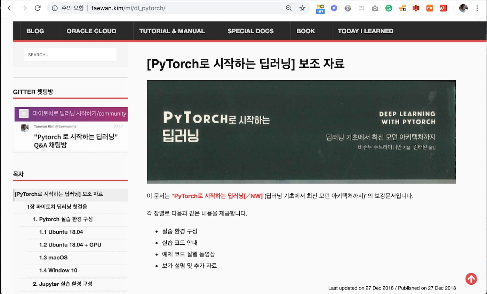

# [PyTorch로 딥러닝 시작하기](http://acornpub.co.kr/book/deep-learning-pytorch)

여기는 [PyTorch로 딥러닝 시작하기](http://acornpub.co.kr/book/deep-learning-pytorch)의 코드 레파지토리입니다. 원서인 [Deep Learning with PyTorch](https://www.packtpub.com/big-data-and-business-intelligence/deep-learning-pytorch?utm_source=github&utm_medium=repository&utm_campaign=9781788624336)는 [Packt](https://www.packtpub.com/?utm_source=github)에서 출간되었고, [에이콘](http://acornpub.co.kr)에서 번역되었습니다. 이 레파지토리는 [PyTorch로 딥러닝 시작하기](http://acornpub.co.kr/book/deep-learning-pytorch) 실습에 필요한 모든 파일을 포함합니다.

[PyTorch로 딥러닝 시작하기](http://acornpub.co.kr/book/deep-learning-pytorch)의 보강 문서인 [](http://taewan.kim/ml/dl_pytorch/)와 이 레파지토리를 함께 참고하시기 바랍니다.

<a href="http://taewan.kim/ml/dl_pytorch/" target="_blank"></a>

## [PyTorch로 딥러닝 시작하기](http://acornpub.co.kr/book/deep-learning-pytorch)에 대하여...

딥러닝를 통해서 구글 보이스 (Google Voice), 시리 (Siri), 알렉사 (Alexa)와 같은 세계에서 가장 지능적인 시스템은 더욱 강력해지고 있습니다. GPU, PyTorch, Keras, Tensorflow, CNTK 등의 소프트웨어 프레임워크와 빅데이터 그리고 강력한 하드웨어의 발전하면서 Text, Vision 및 고급 분석 분야의 여러 문제의 솔루션을보다 쉽게 구현할 수있게되었습니다.

이 책은 가장 진보적인 딥러닝 라이브러리인 PyToch로 소개합니다. PyTorch는 Python으로 작성되었으며, 접근성과 효율성이 뛰어나기 때문에, 데이터 과학 전문가들의 관심을 끌고 있습니다. PyTorch를 설치하는 것으로 시작하여 신속하게 다양한 통계 작업할 수 있습습니다. 앞으로 PyTorch로 신경망을 배우고 CNN, RNN 및 LSTM을 살펴 보겠습니다.

이 책은 ResNet, DenseNet, Inception 및 Seq2Seq와 같은 다양한 최신 딥러닝 아키텍처에 대한 직관을 제공합니다. 지나치게 수학에 의존하지 않습니다. 다음 책을 읽는 동안 GPU 컴퓨팅에 대해 배우게됩니다. PyTorch를 사용하여 모델을 교육하고 생성 네트워크와 같은 복잡한 신경 네트워크로 들어가 텍스트 및 이미지를 생성하는 방법을 살펴볼 것입니다.

이 책을 마치면 PyTorch로 딥러닝 애플리케이션에 쉽게 구현할 수 있습니다. 또한 PyTorch를 시작하고 실행하는 데 필요한 모든 정보를 얻을 수 있습니다.

## 예제 코드 구성

각 장의 코드는 폴더로 구분되어 있습니다. 각 폴더는 번호와 응용 프로그램 이름으로 시작됩니다. 예 : Chapter02.

코드는 다음과 같은 형태로 제공됩니다.

```
x,y = get_data() # x - 학습 데이터,y - 목적변수
w,b = get_weights() # w,b - 학습 파라미터
for i in range(500):
y_pred = simple_network(x) # wx + b 연산 함수
loss = loss_fn(y,y_pred) # y와 y_pred의 차이 제곱 합
if i % 50 == 0:
print(loss)
optimize(learning_rate) # 오차를 최소화하도록 w, b를 조정
```

1장(딥러닝 시작하기) 9장(마지막 그리소 새로운 시작)을 제외한 2 ~8장은 모두 Jupyter 노트북이 제공됩니다. 책에서는 지면을 절약하기 위해서 코드를 실행하는 데 필요한 import 포함하지 않을 수 있습니다. 노트북에서는 모든 코드를 실행할 수 있습니다. 이 책은 실용적인 설명에 중점을두고 있으므로 책을 읽으면서 주피터 노트를 실행해 보시기 바랍니다. GPU가있는 컴퓨터에 액세스하면 코드를 빨리 실행할 수 있습니다. paperspace.com 및 www.crestle.com과 같은 회사는 딥러닝 알고리즘을 실행하는 많은 복잡성을 추상화하는 서비스를 제공합니다.   

## 관련 서적
* [Hands-On Deep Learning with PyTorch](https://www.packtpub.com/big-data-and-business-intelligence/hands-deep-learning-pytorch?utm_source=github&utm_medium=repository&utm_campaign=9781788834131)

* [Advanced Deep Learning with Keras](https://www.packtpub.com/big-data-and-business-intelligence/advanced-deep-learning-keras?utm_source=github&utm_medium=repository&utm_campaign=9781788629416)

* [Deep Learning with TensorFlow - Second Edition](https://www.packtpub.com/big-data-and-business-intelligence/deep-learning-tensorflow-second-edition?utm_source=github&utm_medium=repository&utm_campaign=9781788831109)

## 제안과 피디백
제안 및 피드백: [Click here](https://docs.google.com/forms/d/e/1FAIpQLSe5qwunkGf6PUvzPirPDtuy1Du5Rlzew23UBp2S-P3wB-GcwQ/viewform)
